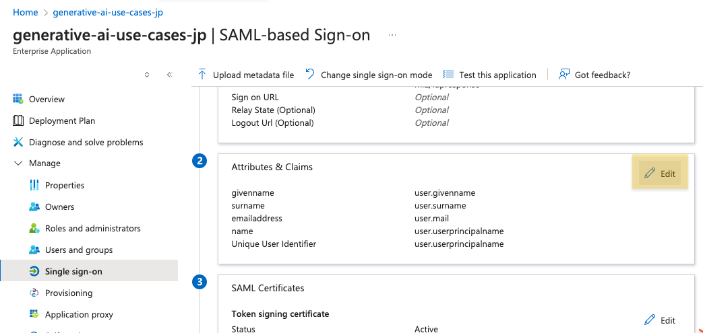
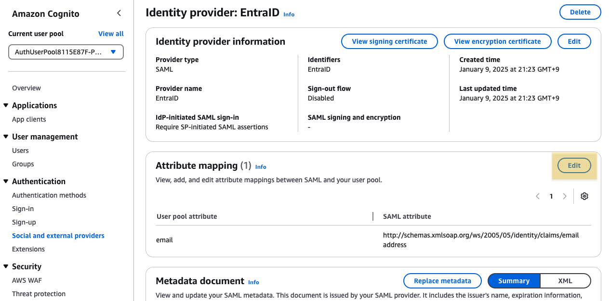

# Microsoft Entra ID と SAML 連携
Microsoft Entra ID (旧 Azure Active Directory) と SAML 連携を行う参考手順を紹介します。詳細なパラメーターは各環境に合わせて変更してください。

# 事前作業
GenU の初回デプロイを行います。初回デプロイを行ったあと、Cognito と Entra ID の SAML 連携を行います。

CloudFormation の Stack の画面で Outputs タブを開き、WebUrl をメモします。


次に、Resource タブから、Cognito user pool の Physical ID をメモします。


# Cognito の設定 : Domain 設定
Cognito domain の設定を進めます。
Cognito user pool の画面で、App integration タブを開き、Domain に関する画面を表示します。Cognito Domain が空白なので、Actions から Create Cognito domain を選択します。


適当に任意の名前を付け、Create Cognito domain を押します。この手順では、`your-preferred-name` とします。世界で一意の名前を付ける必要があります。


Cognito domain が設定されました。


# Microsoft Entra ID の設定
Microsoft Entra ID (旧 Azure Active Directory) で SAML 連携を有効化します。

Microsoft Azure から Microsoft Entra ID の設定画面を開きます。


Enterprise Applications を選択します。


New application を選択します。


Create your own application を選択します。


任意のアプリケーション名を入れて、Create を押します。この例では、`generative-ai-use-cases-jp` としています。


Single sign-on のメニューから SAML を選択します。


Basic SAML Configuration にある Edit を押します。


次のパラメータを入れて保存を押します。[事前作業](#事前作業)で確認した Cognito user pool の ID や、[Cognito の設定 : Domain設定](#Cognito-の設定-:-Domain-設定) で確認した Domain の値を利用します。

Identifier (Entity ID) 

```
# フォーマット
urn:amazon:cognito:sp:<UserPoolID>

# 入力例
urn:amazon:cognito:sp:ap-northeast-1_p0oD4M3F0
```


Reply URL (Assertion Consumer Service URL)

```
# フォーマット
https://<入力した値>.auth.yourRegion.amazoncognito.com/saml2/idpresponse

# 入力例
https://your-preferred-name.auth.ap-northeast-1.amazoncognito.com/saml2/idpresponse
```


値を指定して、Save を押します。


設定が反映されました。


Federation Metadata XML の Download を選択して、XML ファイルを入手します。


このアプリケーションに紐づけるユーザーやグループを追加します。ここで紐づけたユーザーやグループのみログインできます。


この例では、事前に作成していたユーザーを指定します。環境に合わせて指定してください。


Assign を押します。


# Cognito の設定 : Federation

AWS マネジメントコンソールで Cognito の設定作業に戻ります。
Cognito User Pool の画面を開き、Sign-in experience タブから、Add identity provider を選択します。


Entra ID の連携で SAML を利用するため、SAML を選択します。


Provider name に任意の識別しやすい名前を入れます。ここで指定した Provider name を、後の手順で cdk.json に記載します。
Choose file を選び、Entra ID からダウンロードしてきた「Federation Metadata XML」をアップロードします。


User pool attribute に email を指定します。
SAML attribute に、次の文字列を選択して、Add identity provider を選択します。

```
http://schemas.xmlsoap.org/ws/2005/05/identity/claims/emailaddress
```


設定が追加されました。


# Cognito の設定 : Hosted UI

追加した Entra ID との連携を Hosted UI で利用するための設定をしていきます。App Integration タブを選択します。


既存の App Client を指定します。


Edit を押します。


[事前作業](#事前作業)で確認した WebUrl の値を Allowed callback URLs と Allowed sign-out URLs に入力します。
[ローカル開発環境](/docs/DEVELOPMENT.md) を利用してフロントエンドの開発を行いたい場合は、`http://localhost:5173` も Allowed callback URLs と Allowed sign-out URLs に追加で入力します。


Identity Provider で EntraID を選択します。また、Cognito user pool を利用した認証は停止したいため、Cognito user pool のチェックボックスを外します。


Save  changes を押します。


追加されました。


# cdk.json の編集

これで設定が完了したため、cdk.json の値を変更します。

- samlAuthEnabled : `true` を指定します。SAML 専用の認証画面に切り替わり、Cognito user pools を利用した従来の認証機能は利用できなくなります。
- samlCognitoDomainName : [「Cognito の設定 : Domain設定」](#Cognito-の設定-:-Domain-設定) で指定した Cognito Domain 名を入力します。
- samlCognitoFederatedIdentityProviderName : [「Cognito の設定 : Federation」](#Cognito-の設定-:-Federation) で設定した Identity Provider の名前を入力します。


```json
  "context": {
　　 <省略>
    "samlAuthEnabled": true,
    "samlCognitoDomainName": "your-preferred-name.auth.ap-northeast-1.amazoncognito.com",
    "samlCognitoFederatedIdentityProviderName": "EntraID",
```

設定後、再度デプロイを行うと SAML 連携が有効化されます。

---

# (オプション) SAML IdP group custom attribute の設定

ここからは SAML IdP で管理している Role や Group を Cognito の Attribute にマッピングを行い RAG のフィルタリングを行う方法を紹介します。

まず、Entra ID の Enterprise Application 画面にて、Attribute & Claims の Edit を選択し編集します。



Add a group claim から、Group Claim を追加します。この際アプリケーション側に共有するグループの範囲を要件に応じて選択します。（詳細は[こちら](https://learn.microsoft.com/en-us/entra/identity/hybrid/connect/how-to-connect-fed-group-claims))


続いて、Cognito の User Pool の画面にて、Sign-up から、Custom attributes の追加画面を開きます。


適切な名前の Custom Attribute を作成します。この例では、`idpGroup` としています。


続いて Social Identity Provider の画面にて、Attribute mapping の画面を開きます。



先程作成した Custom Attribute 名と、Entra ID の Group Claim `http://schemas.microsoft.com/ws/2008/06/identity/claims/groups` をマッピングします。


これにて Entra ID で定義した Group を Cognito の Attribute にマッピングすることができました。

Custom Attribute は ID トークンに含まれるため、アプリケーション側で利用することができるようになりました。

Knowledge Base RAG のフィルタリングにて使用する場合は `packages/common/src/custom/rag-knowledge-base.ts` の `getDynamicFilters` 関数内の `Example2` のコメントアウトを外してください。

```typescript
// Example 2: Filter by SAML IdP group custom attribute (Check steps to setup attribute mapping in docs/SAML_WITH_ENTRA_ID.md)

const groups = (idTokenPayload['custom:idpGroup'] as string) // group を string で保持している (i.e. [group1id, group2id])
  .slice(1, -1) // 先頭と末尾の括弧を削除
  .split(/, ?/) // カンマとスペースで分割
  .filter(Boolean); // 空文字列を除去;
if (!groups) throw new Error('custom:idpGroup is not set'); // Group が設定されていない場合はアクセスできずにエラーにする
const groupFilter: RetrievalFilter = {
  in: {
    key: 'group',
    value: groups,
  },
};
dynamicFilters.push(groupFilter);
```

ドキュメントの group メタデータにて、ユーザーの IdP のグループの Object ID を指定している場合にフィルタリングが適用されます。

同様に他のメタデータについても、Cognito の Custom Attribute と Attribute Mapping を使用して利用することが可能です。
