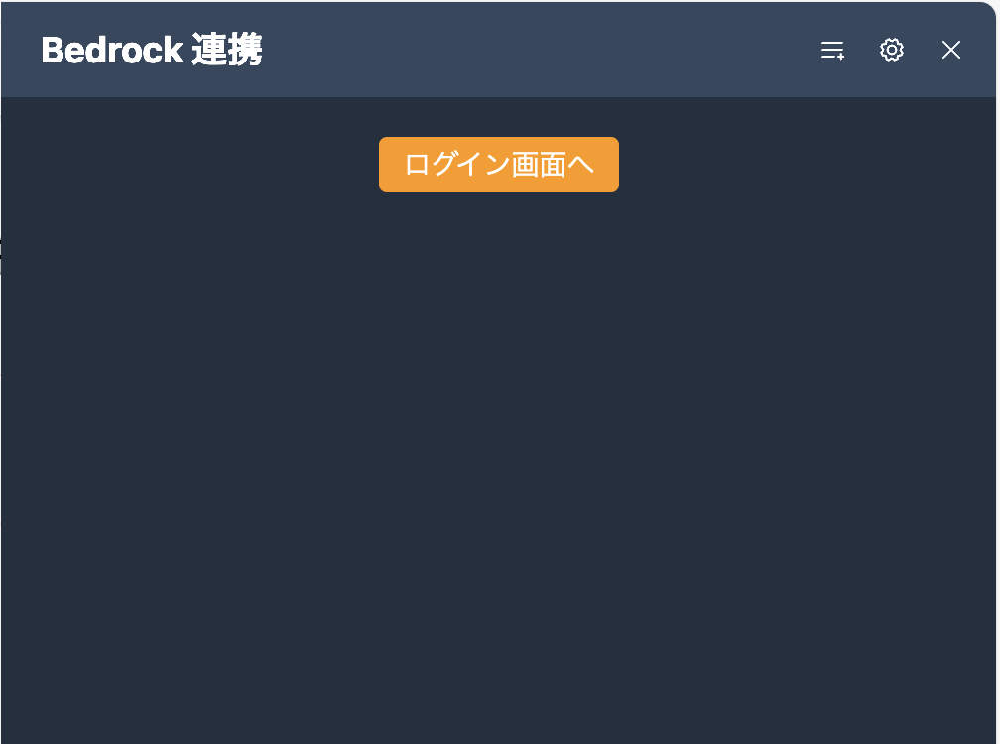
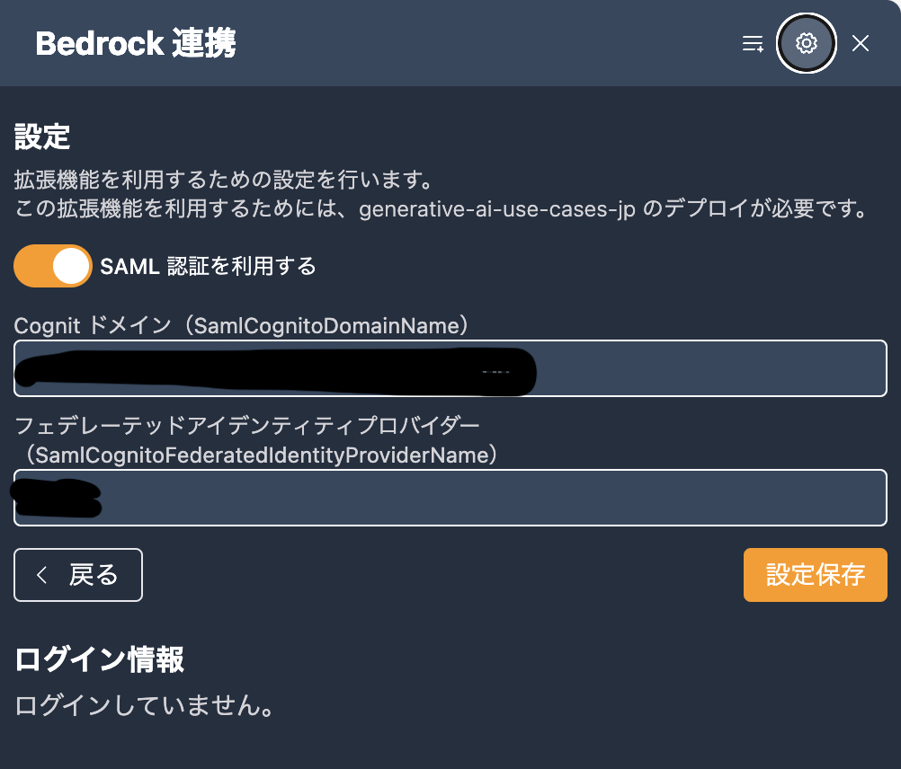
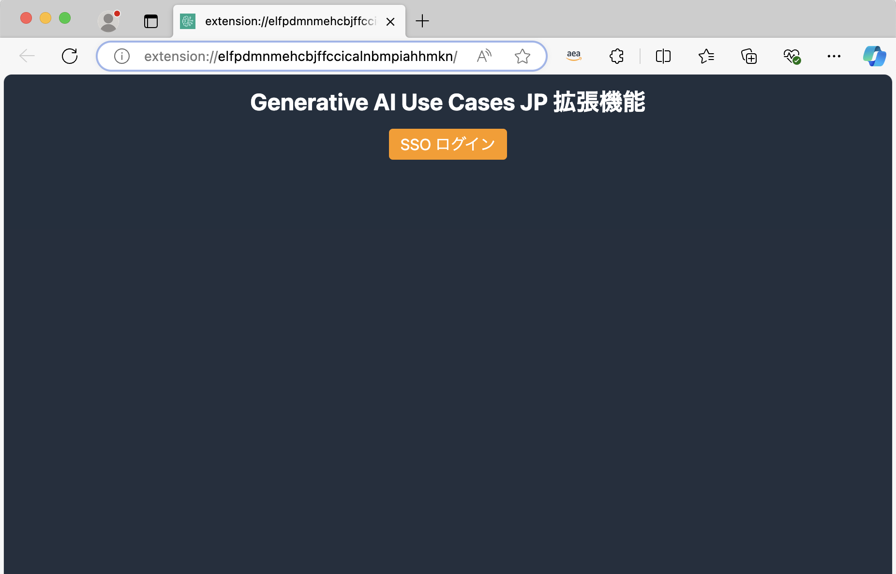
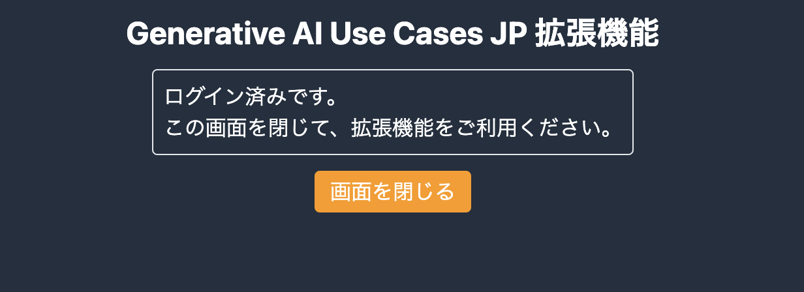

# ブラウザ拡張機能の SAML 認証方法

## 前提条件

ブラウザ拡張機能で SAML 認証を行うためには、GenU で事前に SAML 連携の設定を行なっている必要があります。事前に、[こちらの手順](./DEPLOY_OPTION.md#saml-認証)を参考に設定を行なってください。

## 利用手順

### ブラウザ拡張機能のビルドとインストール

まずは、[こちら](/browser-extension/README.md#利用方法)を参考に、ブラウザ拡張機能のビルドとインストールを行なってください。GenU で SAML 連携の設定を行なった後にビルドを行うと、自動で SAML 認証に必要な情報が設定されるので、最初に GenU の設定を行うことをオススメします。

### Cognito の設定

SAML 認証を行う際に、Cognito からブラウザ拡張機能に対して、コールバックを行う必要があります。そのため、Cognito アプリケーションクライアントのコールバック URL にブラウザ拡張機能の URL を追加します。

#### 拡張機能の URL 確認

まず、インストールしたブラウザ拡張機能を開いて、「ログイン画面へ」ボタンを押してください。



もし、上記の画面ではなく通常のユーザー認証画面が表示された場合は、設定画面を開いて「SAML認証」を有効化し、必要な項目を入力してください。設定値は、[こちらの方法](./EXTENSION_BUILD.md#その他のユーザー-windows-等)で確認できます。


「ログイン画面へ」ボタンを押すと、以下の SAML 認証を行う画面が"新しいタブ"に表示されます。Cognito の設定をしていないため、まだログインできません。Cognito の設定に利用するので、この画面の URL をコピーして、メモしてください。


#### Cognito の Hosted UI の設定

GenU の SAML の設定で Cognito の Hosted UI を設定しましたが、そちらに拡張機能の URL を「許可されているコールバック URL」として設定します。詳細は、以下の手順をご覧ください。

- [Microsoft Entra ID の場合](./SAML_WITH_ENTRA_ID.md#cognito-の設定--hosted-ui)
- [Google Workspace の場合](./SAML_WITH_GOOGLE_WORKSPACE.md#cognito-の設定--hosted-ui)

「拡張機能の URL 確認」でメモしていた拡張機能の URL を、「許可されているコールバック URL」に設定してください。拡張機能の URL は、必ず以下の形式にしてください。

```text
chrome-extension://拡張機能のID/index.html
```

>[!IMPORTANT]
> Microsoft Edgeを利用している場合は、ブラウザ上のURLは `extension://拡張機能のID/index.html` となっていますが、Cognito の設定は、`chrome-extension` と表記する必要があります。

### 動作確認

ブラウザ拡張機能のログイン画面から、SAML 認証を行なってください。認証に成功したら、以下のような画面が表示されます。

